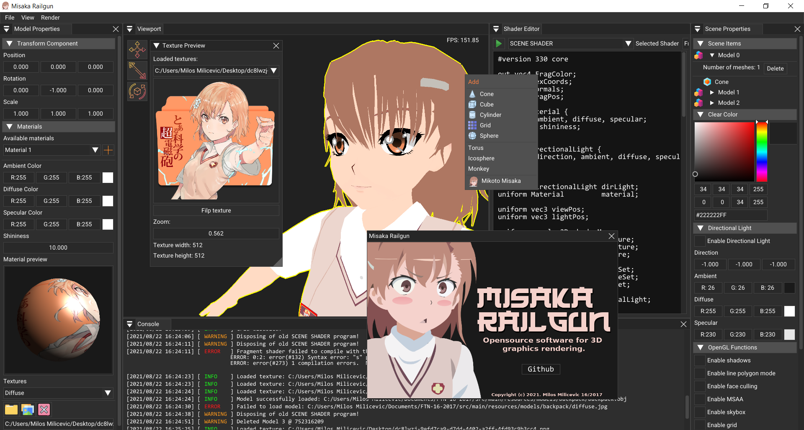

# Basics of computer graphics through the development of 3D rendering software (OpenGL & ImGui)

## <i> FTN 16-2017 Graduate Thesis - Project Misaka Railgun </i>

Through this project I aim to explain how basics of computer graphics works using <a href="https://www.opengl.org/"> OpenGL graphics API </a> in combination with <a href="https://github.com/ocornut/imgui"> Dear ImGui </a> to create simple 3D rendering software that looks somewhat cool in my own way. Project name Misaka Railgun comes from main anime protagonist Mikoto Misaka from <a href="https://www.imdb.com/title/tt1515996/"> "A Certain Scientific Railgun" </a> anime series.

> :warning: **This program is still in development and may contain bugs.**

## Preview

## Features

* Importing 3D models from files such as: FBX, OBJ, 3DS and many others that are supported by <a href="https://www.assimp.org/"> Assimp</a>.
* Creating new or editing old materials for meshes that imported model contains.
    * Ambient, Diffuse and Specular colors.
    * Material shininess.
    * Diffuse and Specular texture. (Normal texture is not yet implemented)
* Model manipulation in 3D scene: Translate, Scale and Rotate.
* Mesh deletion and mesh material changer.
* Rendering skybox with preexisting textures or adding new skybox textures.
* Applying directional light to all models in scene.
* Rendering shadows.
* Shader editor:
    * Editing exising shader programs.
    * Compiling them.
    * Errors are displayed in console in details.
* Rendering scene to image file.

## Topics covered in this thesis

* History of computer graphics.
* What is Modern OpenGL? (<a href="https://www.vulkan.org/">Vulkan</a>, <a href="https://www.microsoft.com/en-us/download/details.aspx?id=35"> DirectX</a>)
* Introduction for some libraries like: GLFW, Assimp, STB, ImGui
* How graphics pipeline works.
* Programming in GLSL.
* Vertex, Array and Element buffers.
* 2D Textures.
* Math for 3D graphics. (Matrices and vectors)
* First Person Camera implementation.
* Adding lights to scene. (Directional light only)
* Working with materials.
* Model loading with Assimp.
* Framebuffers and Multisample framebuffers.
* Cubemaps. Skybox implementation.
* Testing some more OpenGL functions.
* Shadow mapping.
* Final toughts.

## Program manual

* By holding right mouse button down you will enter first person mode and will be able to move on W, A, S, D keys.
* Pressing S key you will select Scale mode for model mainpulation.
* Pressing T key you will select Transalte mode for model mainpulation.
* Pressing R key you will select Rotate mode for model mainpulation.
* Pressing mouse middle button on viewport dock context menu will be opened for adding new preexisting models to scene.
* You can select model by holding down CTRL and clicking on model with mouse left button.
* Everything elese is done using controls displayed in existing docks in program.

## Licence
Project Misaka Railgun is licensed under the MIT License, see LICENSE for more information.

